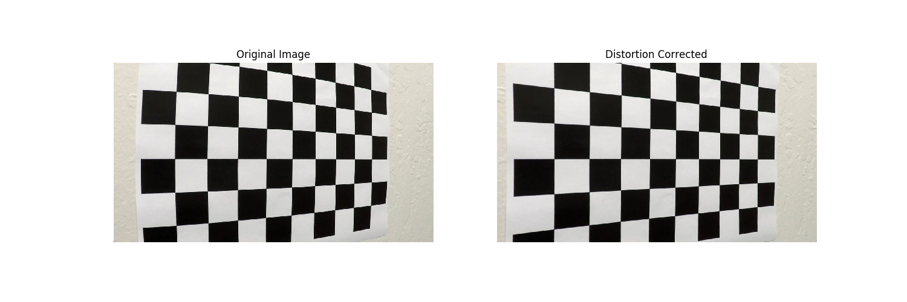
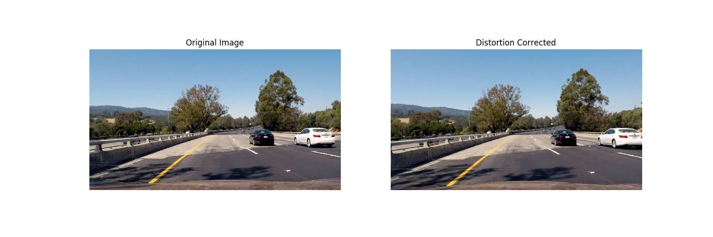
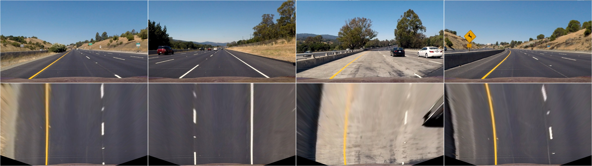
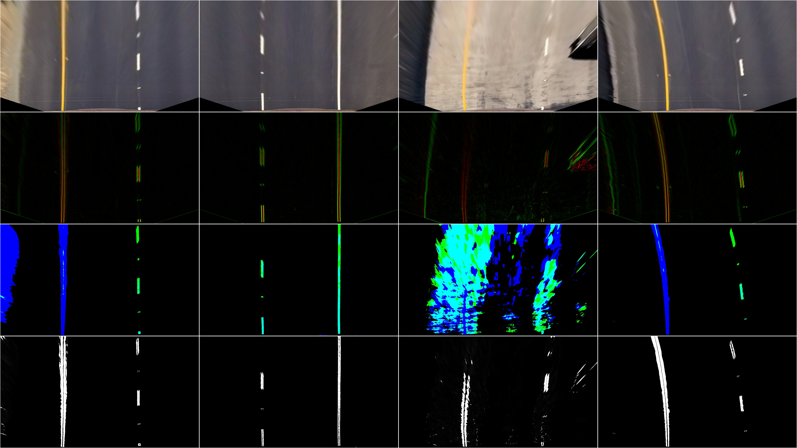
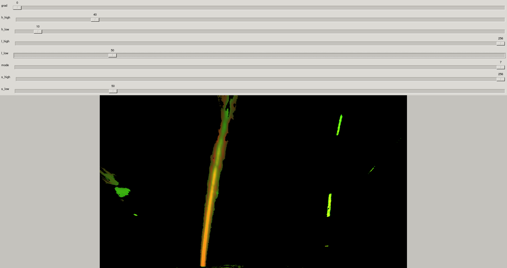
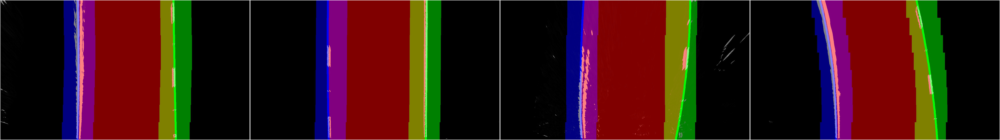
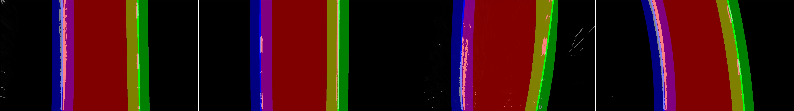
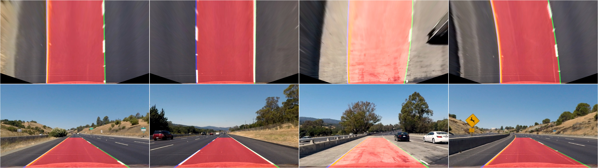
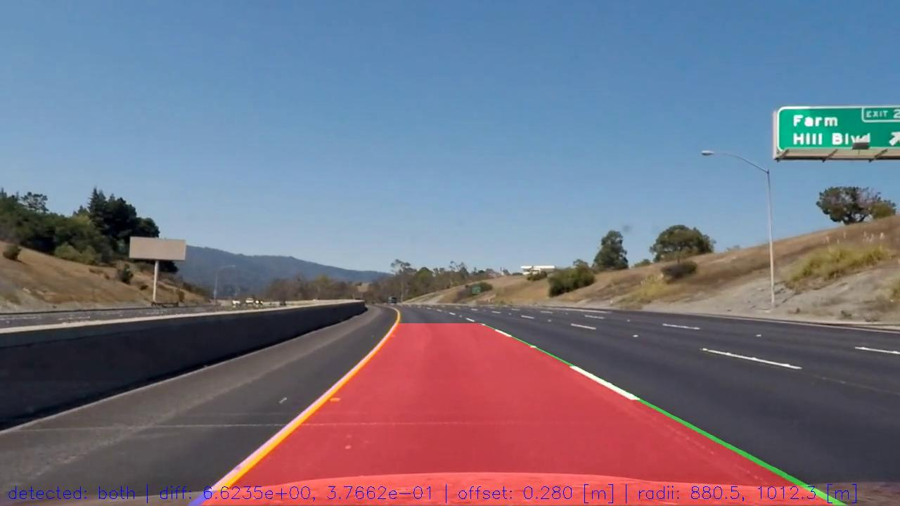

## Advanced Lane Finding

This project implements an algorithm to detect lane lines from camera images. It works by

- calibrating the camera using pictures of a chessboard pattern
- using the calibration parameters to correct distortions of the camera lens
- applying a perspective transform based on the camera's mounting position in the car to obtain a birds-eye view of the road ahead
- transforming the image to HLS colorspace to detect lane lines
- fitting parametric curves to the lane lines
- determining curvature of the lane and center offset of the vehicle
- using knowledge of previously found lanes to make detection more robust
- projecting the fitted curves back to the original image and displaying numerical information about curvature and offset

### Demo

### Repository

#### Files

- `camera_cal/` images of chessboard pattern for camera calibration
- `test_images/` example frames of driving
- `output_images/` images from different stages of the pipeline applied to `test_images`
- `challenge_images/` example frames of challenge video in birds-eye view
- `project_video.mp4` evaluation video
- `out_project_video.mp4` pipeline applied to `project_video.mp4`
- `challenge_video.mp4` harder evaluation video
- `out_challenge_video.mp4` pipeline applied to `challenge_video.mp4`
- `main.py` implementation of the pipeline and application to test images and videos
- `parameter_explorer.py` modified version of my [previous line detection explorer](https://github.com/pesser/line_finder_explorer) to explore parameters interactively
- `README.md` this document which is also my writeup for the project. See also a [rendered version](https://github.com/pesser/lane_finding)

#### Useage

To run the pipeline on the test images and videos:

    python main.py

For interactive exploration of parameters for lane detection in HLS colorspace:

    python parameter_explorer.py image1 [image2 ...]

Use `n` to cycle through images and `q` to quit. Mode determines a bitmask of length three and only HLS channels with their bit set are shown. Mode zero shows my final parameters.

### Description

#### Camera Calibration

Camera calibration parameters are computed in `calibrate_camera()` with the help of [OpenCV](http://opencv.org/) and the provided calibration pictures of a chessboard pattern found in `camera_cal/`.

Some of the images do not contain all of the chessboard corners and they are simply ignored since the remaining images seem to be enough for calibration. It is assumed that the chessboard pattern is flat and has square rectangles and thus for object coordinates the `z == 0` plane of a 3D integer lattice used.

Using the camera matrix and distortion coefficients from the calibration process we obtain the following result with OpenCV's `undistort()`:

Notice especially at the left edge how the chessboard pattern aligns with the image edge after distortion correction.

#### Image pipeline

##### Distortion Correction
Once the calibration parameters are available, images collected on the road can be corrected in the same way as above:

##### Perspective Transform

I decided to perform the perspective transform before thresholding the image because the perspective transform puts more focus on the lane lines and this will make it easier to evaluate the thresholding algorithm.

At first I selected reasonable source points based on the undistorted versions of the test images containing straight lines. Then I fine-tuned them with a correction by looking at the transformed images and making sure they show straight lines. The final warping parameters are

| Location	| Source        | Destination   | 
|:-------------:|:-------------:|:-------------:| 
| top left	| 578, 460      | 391.5, 0      | 
| top right	| 702, 460      | 888.5, 0      |
| bottom left	| 190, 720      | 391.5, 720    |
| bottom right	| 1090, 720     | 888.5, 720    |

They are used in `get_warp_params()` to obtain the transformation matrices to and from birds-eye perspective with the help of [`cv2.getPerspectiveTransform()`](http://docs.opencv.org/2.4/modules/imgproc/doc/geometric_transformations.html#getperspectivetransform). Warping is implemented in `warp()` using [`cv2.warpPerspective()`](http://docs.opencv.org/2.4/modules/imgproc/doc/geometric_transformations.html#warpperspective) and the transformation matrix, which gives the following result:

##### Thresholding

To generate a binary image in `threshold()`, I first convert the birds-eye image to [HLS colorspace](https://en.wikipedia.org/wiki/HSL_and_HSV). Since the image is already in birds-eye perspective, I know that I am mainly looking for vertical lines and thus I compute the gradient only in horizontal direction using [`cv2.Sobel()`](http://docs.opencv.org/2.4/doc/tutorials/imgproc/imgtrans/sobel_derivatives/sobel_derivatives.html#sobel-operator) and perform thresholding based on the magnitude. The gradients are computed on the L- and S-channels which gave the most robust results. Using only informations about  gradients, one also detects the lines where the road ends. To differentiate these lines from the lane lines I also compute masks for yellow and white regions and only consider lines within these regions. The whole process is visualized in the next image:

The first row shows the original birds-eye image, the second row the x-direction gradients on S- and L-channels. Notice how the lines at the end of the road are picked up in the third and fourth column. The third row shows the color masks computed to get rid of these unwanted lines. The fourth row shows that combining the color masks with the gradients does produce the desired result. The color mask in the third column is quite noisy, however this was necessary to be able to detect lanes also in the more challenging video and required quite some experimentation with the parameters to find a good balance that works for both videos. To accelerate this process I adapted code from [one of my previous projects](https://github.com/pesser/line_finder_explorer) to explore parameters interactively. The exploration tool looks like this

and gives immediate feedback about the parameters. The final thresholding parameters that I used are

| Color    	| Channel	| Low           | High          | 
|:-------------:|:-------------:|:-------------:|:-------------:| 
| yellow	| h     	| 15            | 41            | 
| yellow	| l      	| 0             | 256           |
| yellow	| s     	| 50            | 256           |
| white 	| h     	| 0             | 256           | 
| white 	| l      	| 180           | 256           |
| white 	| s     	| 0             | 256           |

##### Identify Lane Lines

Based on the thresholded image I create more refined masks for the left and right lane in `get_lane_masks()`. For this, I assume that the left lane will be in the left half of the image and the right lane in the right half. To find an initial guess I take a histogram over the lower half of the left and right halves and determine the guess based on the peak in the histogram. Then I divide the image horizontally 8 times and proceed from the bottom up. I put windows of width 180 centered at the the initial guesses for the left and right lanes. For both windows I then determine an improved estimate of the lane position based on the mean position of all lane points in the current window. Because some of the windows do not contain any lane points and because I assume that the lanes are roughly parallel, I update the positions for _both_ of the windows in the next slice based on the offset of the mean from the center _of the one window which contained more lane points_ and is thus assumed to be more confident in its estimate.
I then take all of the points within the windows to fit a second order polynomial in `get_polyfit()` with the help of [`np.polyfit()`](https://docs.scipy.org/doc/numpy/reference/generated/numpy.polyfit.html). The thresholded image, the mask generated by the windows and the polynomial fit are visualized here:

Notice that the fit for the right lane in the third column does not look quite right. In that case there are not many points for the right lane together with some noise. However, when the pipeline runs on a video, knowledge about previous lane positions can be used to improve the robustness. Furthermore, when applied to consecutive frames, the previously detected lanes can be reused to define the masks by considering the area around the lanes as the mask:

##### Perception

Once the lanes are described by second order polynomials I can compute the [radius of curvature](http://www.intmath.com/applications-differentiation/8-radius-curvature.php) in `infer_radii()` and the vehicle's offset from the center of the lane in `infer_offset()`. To be able to better interpret the data, both radius and offset are converted to meters based on the provided conversion factors of meters per pixel for both x and y axis. Notice that the radius computation then requires the coeffcients of a polynomial fitted in units of meters. Instead of recomputing the polynomial fit, I compute these coefficients based on the polynomial coefficients fitted in units of pixels. This is achieved by comparing the coefficients of the unscaled and rescaled polynomials. Details can be found in the code of `infer_radii()`.

##### Backprojection

To better visualize the results of the lane detection, I backproject the polynomial curves to the original perspective using again `cv2.warpPerspective()` in `unwarp()` but this time with the inverse transformation matrix. The result is shown here:

#### Video pipeline

As can be seen in the third column of the last image, the lane detection is not always perfect for a single image. Therefore I am using knowledge about previous lane positions to improve the robustness. This is implemented in the `SmoothLanes` class. The class' `__call__` method is called consecutively for each frame of a video using [`moviepy`](http://zulko.github.io/moviepy/)'s [`fl_image`](http://zulko.github.io/moviepy/ref/VideoClip/VideoClip.html?highlight=fl_image#moviepy.video.VideoClip.VideoClip.fl_image) function. Since moviepy uses RGB ordering, I first convert to BGR as used by OpenCV. I then apply a similiar pipeline as above with the following exceptions.

##### Lane masking

As already described above, instead of computing masks for the left and right lanes based on histograms and windows from scratch, we can simply use the area around previously detected lanes as masks.

##### Lane detection

It might even happen that we can find points for only one of the lanes or even for none of them. If only one of them is found, I assume that they are parallel and translate the curve of the detected lane to the last known position of the missing lane. If this is in stark contrast to its previous shape, this will be detected at the next outlier detection step described below. If none of the lanes are detected there is not much that can be done and I just keep the curves from the last detection. However, this case did not occur for the two videos that I tested on.

##### Outlier detection

To avoid nonsense detections which would also cause subsequent performance to deteriorate (because the next mask will be built around that detection) I perform a sanity check based on the squared l2 distance between the polynomial coefficients of the current and previous lane fittings. If this distance is above an empirically determined threshold I discard the current detection and reuse the previous one.

##### Moving average

To smoothen the detections and reduce the noise I use an [exponential moving average](https://en.wikipedia.org/wiki/Moving_average#Exponential_moving_average) of the polynomial coefficients. This increases robustness and gives better visual results. Notice for example in the demo, when the car is going over a bump and therefore the camera is shaking up and down, the lane detection follows this up and down movement instead of maintaining a perfect fit to the lanes. This is desireable since the large movement is just an artefact caused by the bump and the car's suspension but it does not represent a change in the position of the car relative to the lane lines.

##### Information display

Information about how many lanes were detected, the l2 distance of the polynomial coefficients to the previous ones, the vehicle's distance to the center of the lane and the radii  of the lane lines are displayed in each frame of the video:

#### Discussion

The final result works on both the project video as well as the challenge video. However, the first version which worked on the project video failed on the challenge video. It turned out that I highly overfitted the parameters to the project video. After quite some experimentation with the parameters I managed to make it work on both videos but again it failed on the even harder second challenge video. While machine learning approaches also suffer from overfitting, here the problem seems to be even more pronounced because due to the manual exploration of the parameter space one is quite limited in the amount of different data samples that one can look at. To improve this aspect I added frames from the challenge video to the parameter exploration process (found in `challenge_images/`) but it was not enough to generalize to the second challenge video. The current implementation will also fail when lanes are changed which should be improved upon by detecting when lanes go out of view and/or cross the middle of the image. Another disadvantage is the required recalibration if the camera lens or its mounting position change.
